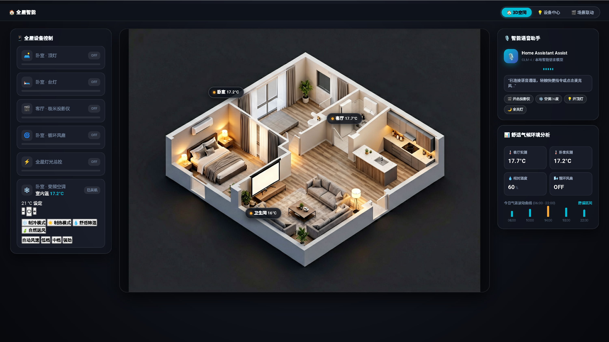

# Theme Center · Next-Gen Smart Home Control Suite

**English** | [简体中文](README.md) | [Changelog](CHANGELOG.md)

[](https://github.com/deltrivx/ThemeCenter/releases/latest)
[](https://www.home-assistant.io/)
[](LICENSE)

Universal 3D Glassmorphism Dashboard, Smart Scaffolder & Visual Enhancement Suite for Home Assistant.



## Features
- **Next-Gen Aesthetics**: WebGL 3D floorplan perspective with interactive Liquid Glass cards.
- **Smart Scaffolder**: Auto-discovers local areas and entities, generating tailored dashboards with zero manual YAML editing.
- **Adaptive Performance Engine**: Multi-tier performance profiles (Ultra/High/Balanced/Low-Power) ensuring smooth 60fps from cheap wall-mount tablets to iPads.
- **Non-Intrusive Architecture**: Smooth switching between native theme and 3D control center without altering default HA sidebar or layouts.

## Quick Installation

### Option 1: HACS (Recommended)
1. Navigate to **HACS** in Home Assistant.
2. Click top-right menu → **Custom repositories**.
3. Add `https://github.com/deltrivx/ThemeCenter` as **Lovelace**.
4. Download and refresh.

### Option 2: Shell OTA
Run in your Home Assistant terminal:
```bash
curl -fsSL https://raw.githubusercontent.com/deltrivx/ThemeCenter/main/scripts/install.sh | bash
```
